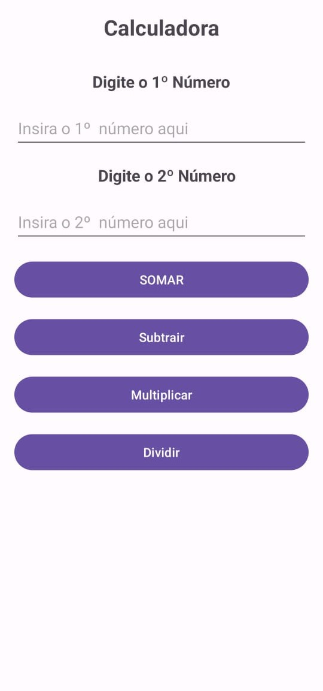

# Calculadora simples 

Este é um código Java para uma aplicação Android de uma calculadora simples. Aqui está um resumo das principais partes do código:

1. **Variáveis e Componentes de Interface:**
   - Declaração de variáveis para botões de operação e campos de texto.
   - Inicialização dos componentes no método `onCreate`.

2. **Event Listeners:**
   - Adição de ouvintes de clique para os botões de operação (`btSomar`, `btSubtrair`, `btMultiplicar`, `btDividir`).

3. **Método `realizarOperacao`:**
   - Método privado que executa operações matemáticas com base no operador fornecido.
   - Obtém valores dos campos de texto, realiza a operação e lida com a divisão por zero.
   - Exibe o resultado em um AlertDialog.

4. **Método `exibirMensagem`:**
   - Método privado para exibir mensagens em um AlertDialog.

5. **Funcionamento Geral:**
   - A aplicação permite ao usuário inserir dois números e escolher uma operação (adição, subtração, multiplicação, divisão).
   - As operações são realizadas quando os botões correspondentes são clicados, e o resultado é exibido em um AlertDialog.
   - O código inclui tratamento para divisão por zero.

Note que a lógica da calculadora é implementada principalmente no método `realizarOperacao`, utilizando um switch-case para determinar a operação com base no operador escolhido. O resultado é então exibido em um AlertDialog usando o método `exibirMensagem`.

---

